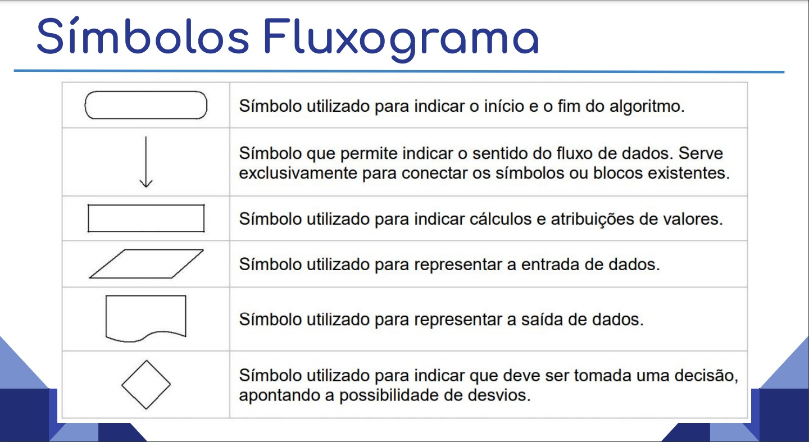
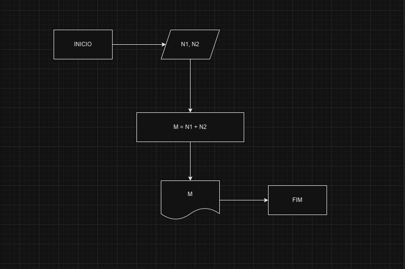
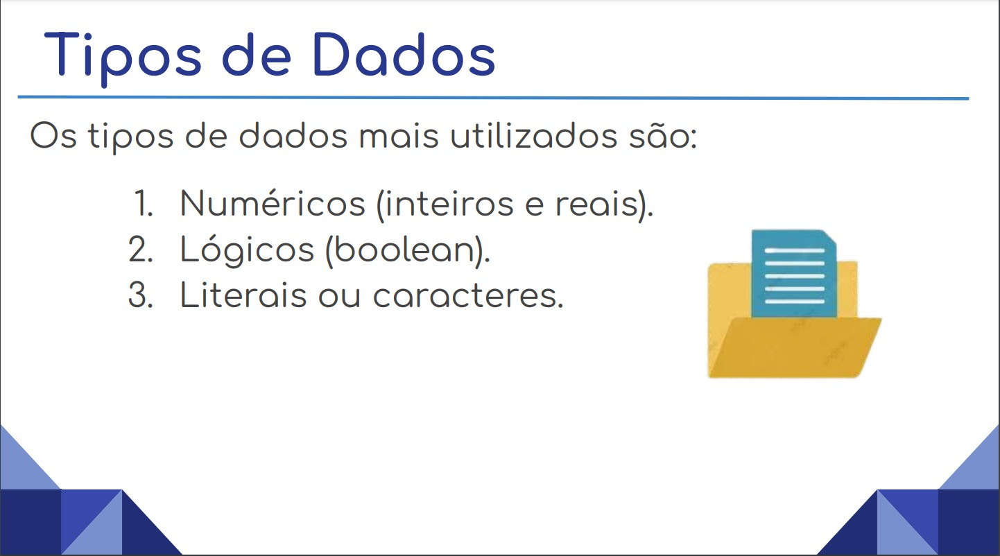

# Fluxograma 📊

- Este repositório é sobre fluxograma, o objetivo é ensinar os conceitos e fundamentos, incluindo sua leitura, criação e interpretação.

### **O que é fluxograma ?**
- É um diagrama que ilustra as etapas, sequências e decisões de um processo ou fluxo de trabalho. É uma ferramenta muito utilizada para planejar, visualizar, documentar e otimizar processos em diversas áreas de conhecimento.

- Componentes básicos (formas e símbolos).

### **Tipos de dados de um fluxograma**

## **Ferramentas para Criar Fluxogramas**

Microsoft Visio
Lucidchart
Draw.io (recomendado)
Outras opções gratuitas e pagas.
